# Hanko Plugin for Keycloak

This is an extension to Keycloak which integrates passwordless authentication via Hanko.

For more information about Keycloak, please visit the [Keycloak homepage](https://www.keycloak.org/).

For more information about Hanko, please visit the [Hanko homepage](https://hanko.io/).

## Features

- Log in with either password, Hanko Authenticator (FIDO UAF) or WebAuthn (FIDO2).
- Account-page to register and deregister a Hanko Authenticator or any FIDO2 authenticator via WebAuthn.
- Enrollment of users via the Keycloak Admin UI - "pre"-register FIDO2 roaming authenticators (security keys)
or initiate device binding using the Hanko Authenticator.

## Table of contents
- [Compatibility](#compatibility)
- [Installation](#installation)
- [Building](#building)
- [Running with Docker](#running-with-docker)
- Configuration
    - [Configure a client](#configure-a-client)
    - [Configure authentication flows](#configure-authentication-flows)
      - [Prerequisites](#prerequisites)
      - [Passwordless authentication flow](#passwordless-authentication-flow)
      - [Passwordless authentication flow with password fallback](#passwordless-authentication-flow-with-password-fallback)
    - [Configure enrollment](#configure-enrollment)
- Usage
    - [Using the account page](#using-the-account-page)
        - [First-time access to account page](#accessing-the-account-page)
        - [Registering devices](#registering-devices)
        - [Renaming devices and deregistering devices](#renaming-devices-and-deregistering-devices)
        - [Login using registered devices](#login-using-registered-devices)
            - [Login with passwordless flow](#login-with-passwordless-flow)
            - [Login with passwordless flow with password fallback](#login-with-passwordless-flow-with-password-fallback)
    - [Using enrollment](#using-enrollment)
        - [Who can enroll other users?](#who-can-enroll-other-users)
        - [Enrolling users](#enrolling-users)
- [Theming the account page](#theming-the-account-page)

## Compatibility

The latest version of this plugin (1.0.0) has been tested with Keycloak 9.0.3.

You can also build the plugin yourself, see section [Building](#building) for more details.

## Installation

1. Download the latest version artifacts (`hanko-keycloak-plugin.ear`) from the 
[GitHub releases page](https://github.com/teamhanko/hanko-keycloak-plugin/releases) or build them yourself 
(see section [Building](#building)).
2. Copy `hanko-keycloak-plugin.ear` to `<KEYCLOAK_ROOT>/standalone/deployments/hanko-keycloak-plugin.ear`

## Building

Ensure you have JDK 8 (or newer), Maven 3.1.1 (or newer) and Git installed:

```
java -version
mvn -version
git --version
```

Clone this repository:

```
git clone https://github.com/teamhanko/hanko-keycloak-plugin.git
cd hanko-keycloak-plugin
```

Build the plugin by running the following in the project root directory:

```
./build.sh
```

You can find the `hanko-keycloak-plugin.ear` in the `target` folder of the `hanko-keycloak-plugin-ear` directory.

## Running with Docker

The repository contains a Dockerfile that can be used to create an image and run Keycloak with the plugin in a container.
The Dockerfile uses the [jboss/keycloak](https://hub.docker.com/r/jboss/keycloak) image. 

1. Build the project artefacts using the `build.sh` script:

```
./build.sh
```

2. Build the Docker image:

```
docker build -t <TAG> .
```

3. Run the container and create an initial admin account (to be able to open Keycloak on localhost map port 8080 
locally).

```
docker run -e KEYCLOAK_USER=<USERNAME> -e KEYCLOAK_PASSWORD=<PASSWORD> -p 8080:8080 <TAG>
```

Keycloak uses an embedded H2 database per default. To run the container using a different database configuration see
the section **Database** for the [jboss/keycloak](https://hub.docker.com/r/jboss/keycloak) image.

### Configure a client

Before you can use the provided account page, you have to add a **Client** to your realm.

> :warning: If you use another realm than **master**, you have to replace **master** with your realm name in the URLs 
> below.:

1. Log in to your Keycloak administration console.
2. Go to configuration section **Clients**.
3. Create a new client called **hanko-account** (in this step exact spelling matters) and leave the Root URL empty.
   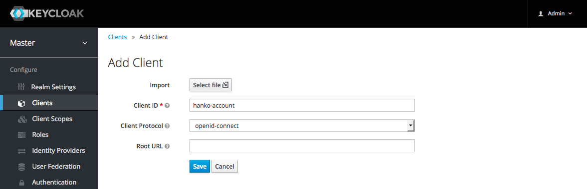
4. In the client configuration, set **Valid Redirect URIs** to **/auth/realms/master/hanko/\*** and add
**/auth/realms/master/hanko** under **Web Origins**.
   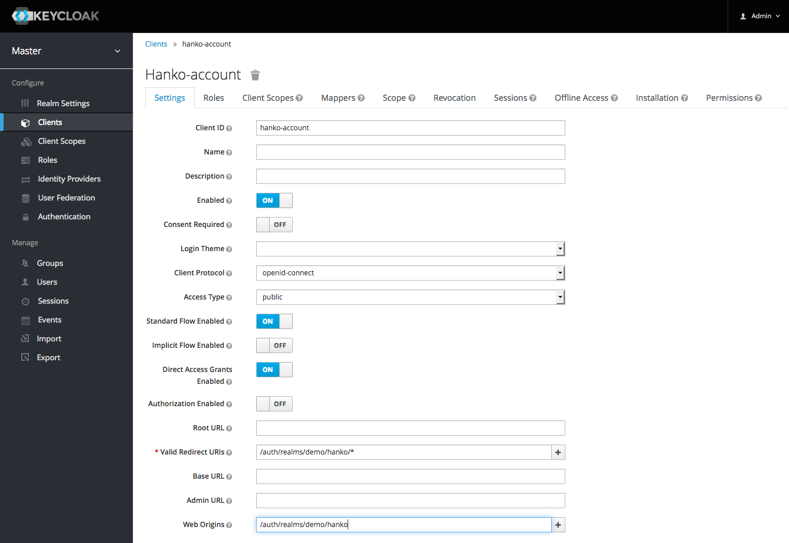
6. Save the hanko-account client configuration.
7. Go to configuration section **Realm Settings**, open the Themes tab and select `hanko-with-keycloak` as your **account-theme**.
   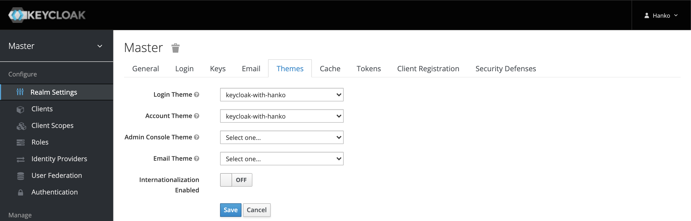

## Configure authentication flows

### Prerequisites

The plugin uses the API of the [Hanko Authentication Service](https://docs.hanko.io/#/auth/start) to perform 
authentication. Hanko API endpoints are [protected](https://docs.hanko.io/#/auth/api/security) and hence require an 
API Key ID/API Key pair to make authorized requests. In order to obtain an API Key ID/API Key pair: 

1. Go to `https://console.hanko.io`
2. Log in or register an account.
3. Once signed in, create an organization. If you already created an organization, select the organization.
4. Add a new relying party with the following properties:
    - Relying Party Name: choose any name you want
    - APP ID: **must** be a url with an `https` scheme.
5. Click "Add new relying party". Select the created relying party to get to the relying party dashboard.
6. On the relying party dashboard, select "General Settings" and then click "Add" in the "API Keys" panel.
This will generate an API Key and an API Key ID. You should store the API Key securely since it cannot be obtained once
you confirm and close the modal displayed after key generation.

> :warning: WARNING: Do not make the API Key publicly available.

The API Key ID/API Key pair will be used to configure Keycloak authentication flows (see the following sections for
details).

### Passwordless authentication flow

1. Log in to your Keycloak administration console.
2. Go to configuration section **Realm Settings**, open the Themes tab and select `keycloak-with-hanko` as your **login-theme**.
If you haven't already done so when [configuring a client](#configure-a-client), select `keycloak-with-hanko` as your **account-theme**.
   
3. Go to configuration section **Authentication**.
4. Select the **Browser** authentication flow.
5. Click **copy** in the top right corner of the table.
   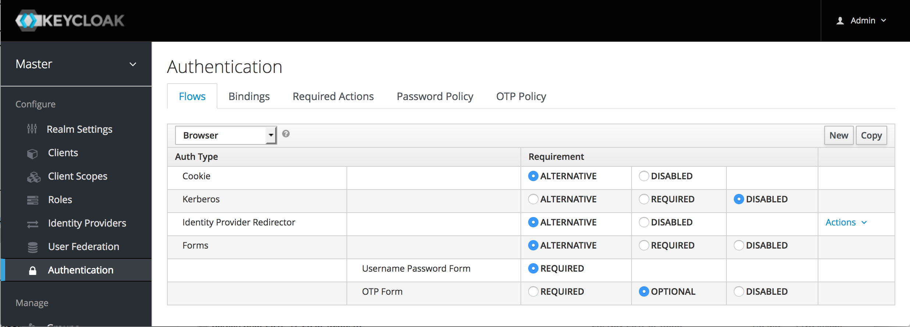
6. Give the new flow a meaningful name, for example **Browser flow with Hanko**.
   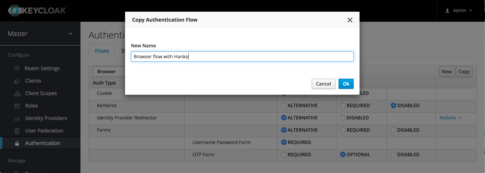
7. Select **Actions** and then **Delete** for the **Username Password Form**.
8. Select **Actions** and then **Delete** for the **OTP Form**.
   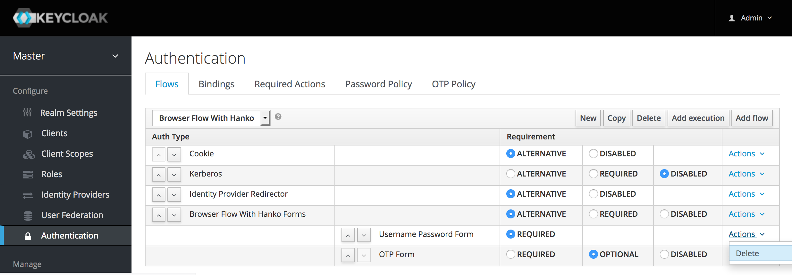
9. Select **Actions** for the **Browser Flow With Hanko Forms** and add the execution **Username Form**.
   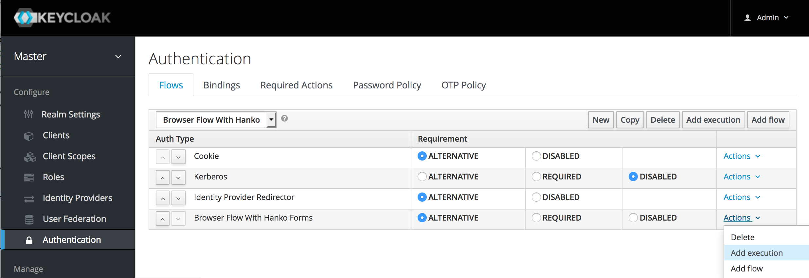
10. Select **Actions** for **Browser Flow With Hanko Forms** and add the execution **Hanko Multi Authenticator**.
Mark it as **required**.
11. Open the configuration of the **Hanko Multi Authenticator** flow by selecting **Actions** -> **Config**. Insert 
your API Key ID and API Key secret. Save the configuration.
    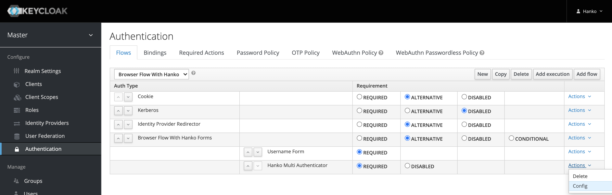
12. Open the **Bindings** tab and change the **Browser Flow** to **Browser flow with Hanko**. Save the configuration.
    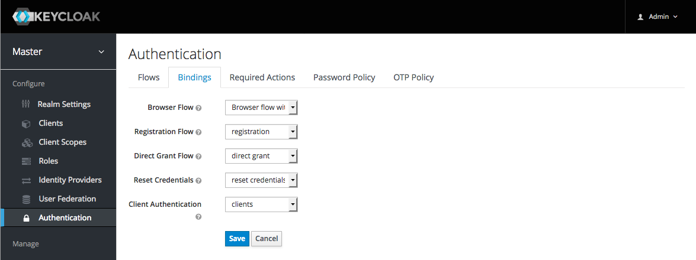
    
> :warning: **WARNING**: Be careful when applying this authentication configuration to the master realm. Using this 
> configuration a user **must** have a device registered in order to properly log in. If you are a master realm admin 
> user without registered devices and apply this configuration as your bound browser flow, you can lock yourself out of
> the administration console. You can register devices using the enrollment feature. See 
> [Configure enrollment](#configure-enrollment) and [Using enrollment](#using-enrollment).

## Passwordless authentication flow with password fallback

If you still want a fallback to passwords as an alternative during login you can do so using a different authentication 
configuration. Perform steps (1)-(9) as described in the previous section, then continue as follows:

10. Select **Actions** for **Browser Flow With Hanko Forms** and select **Add Flow**.
    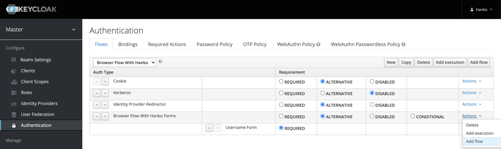
11. Give the flow a meaningful name, e.g. **Authentication**. Click **Save**.
    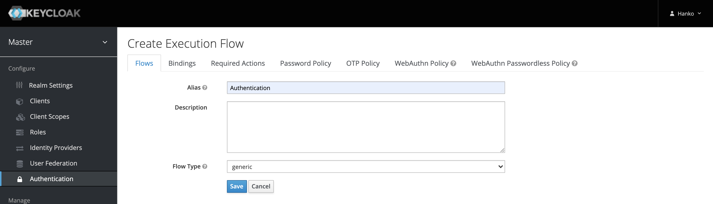
12. Mark the created **Authentication** flow as **required**.
    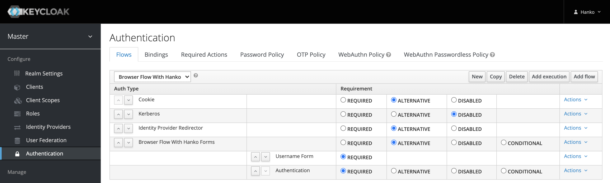
13. Add another flow to the **Authentication** flow.
    
14. Give the flow a meaningful name, e.g. **Passwordless**. Click **Save**.
    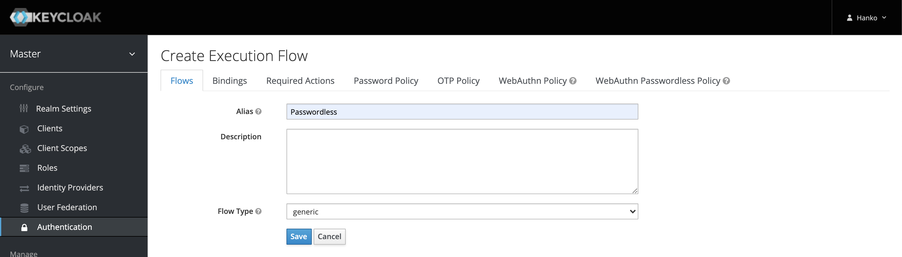
15. Mark the created **Passwordless** flow as **alternative**.
    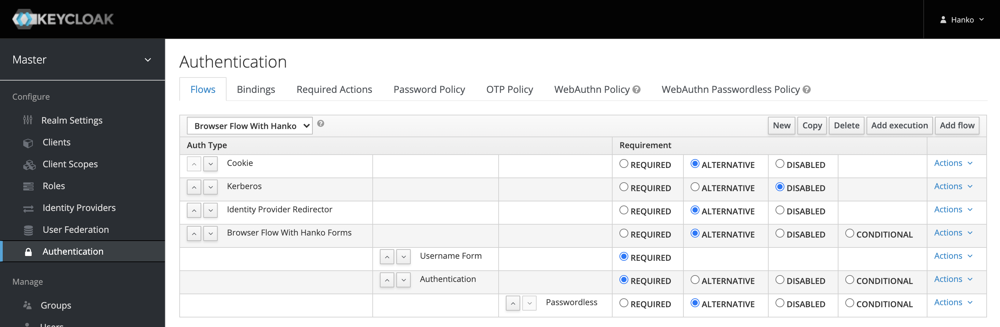
16. Add an execution to the **Passwordless** flow.
    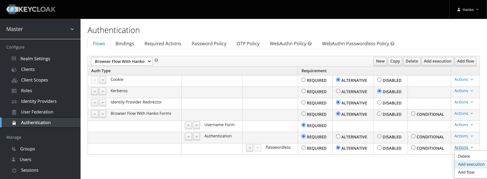
17. Select **Hanko Multi Authenticator**. Click **Save**
    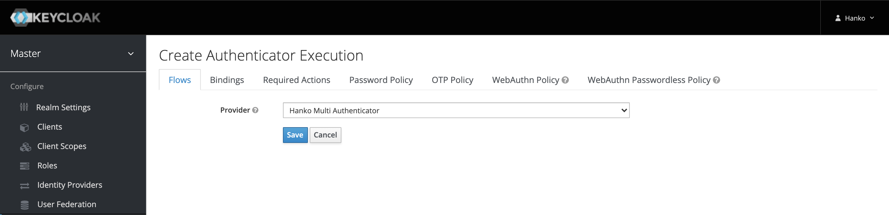
18. Mark the **Hanko Multi Authenticator** execution as **required**.
    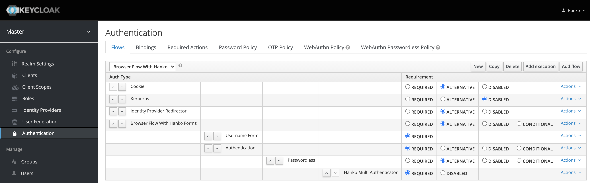
19. Open the configuration of the **Hanko Multi Authenticator** execution by selecting **Actions** -> **Config**. Insert 
    your API Key ID and API Key secret. Save the configuration.
    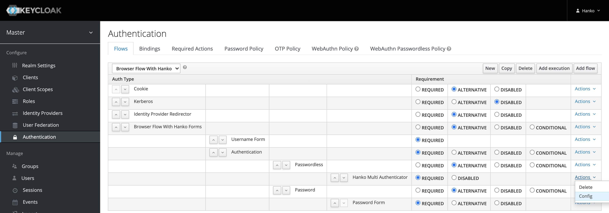
18. Add another flow to the **Authentication** flow (see step 13).
19. Give the flow a meaningful name, e.g. **Password**. Click **Save**.
    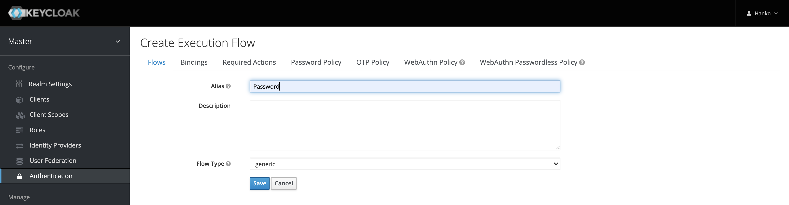
20. Mark the **Password** flow as **alternative**.
    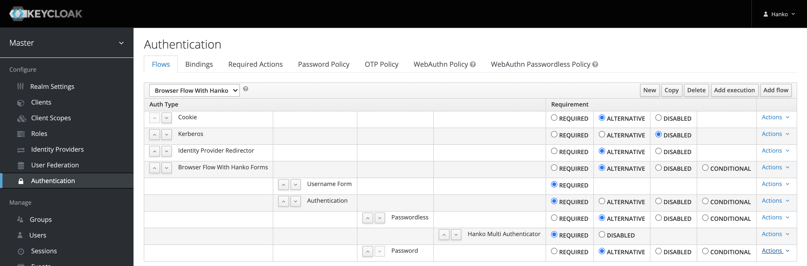
21. Add an execution to the **Passwordless** flow.
    
22. Select **Password Form**. Click **Save**.
    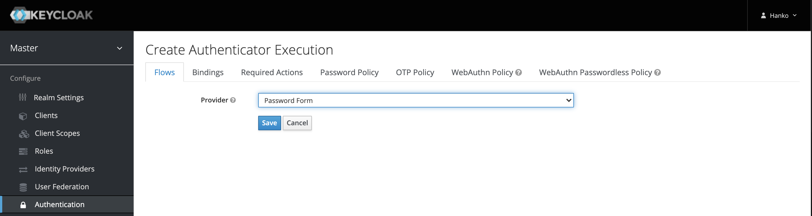
23. Mark the **Password Form** execution as **required**.
    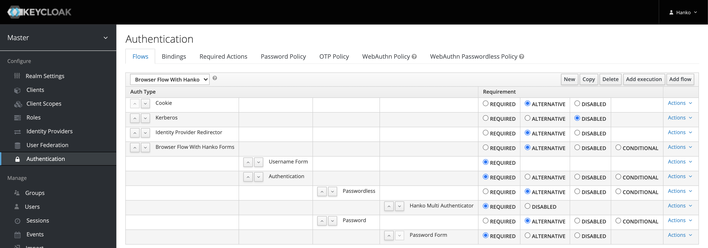
24. Open the **Bindings** tab and change the **Browser Flow** to **Browser flow with Hanko**. Save the configuration.
    

Now you can register and deregister a Hanko Authenticator by visiting the path `/auth/realms/master/hanko/status` at 
your Keycloak`s root-url. See [Using the account page](#using-the-account-page) for usage details.

### Configure enrollment

1. Log in to your Keycloak administration console.
2. Go to configuration section **Realm Settings**, open the Themes tab and select `keycloak-with-hanko` as your **admin-theme**. Click
the **Save** button to save the configuration.
   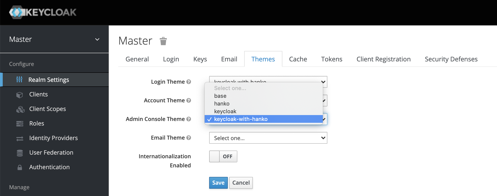
   
In the Keycloak administration console you will now have access to a **Hanko Enrollment** section when viewing 
user details. See [Using enrollment](#using-enrollment) for usage details.

> :warning: **WARNING**: In order to enroll a user from a specific realm the realm of this user  **must** have a 
> **Hanko Multi Authenticator** execution configured in the Authentication configuration of the bound browser flow 
> (see [Configure Authentication Flows](#configure-authentication-flows)).

## Using the account page

### First-time access to account page

Once you visit `/auth/realms/master/hanko/status` (replace **master** with your realm name if necessary) you will be 
presented with a username form. Enter the username or email address for an existing user and submit the form. 

- If you have configured a passwordless authentication flow you will be prompted for authentication with a registered
device. Make sure the user has a device registered. You can use the enrollment feature to do so (see 
[Configure enrollment](#configure-enrollment) and [Using enrollment](#using-enrollment)).
- If you have configured an authentication flow with a password as a fallback, you can enter a password or opt for 
logging in with a registered device. When logging in with a password, make sure a password is set for the user 
(you can do so in the Keycloak administration console via **Manage** -> **Users** -> Select user -> **Credentials** -> **Set password**).

After logging in you will be presented with the account page:

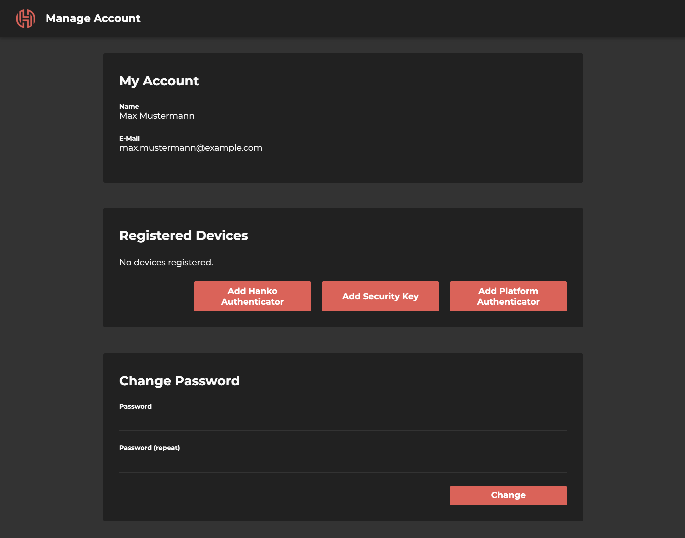

### Registering devices

You can register devices using the buttons provided in the **Registered Devices** panel:

- To register using Hanko Authenticator, select **Add Hanko Authenticator**. You will be presented with a QR code. 
Scan the QR code using the authenticator app on your mobile device. You will be prompted for an authentication gesture
(e.g. biometric or PIN). Confirm registration by performing the authentication gesture with your device. 
- To register a security key, select **Add Security Key**. The browser will prompt you to attach a security key to 
your device and perform an authentication gesture. Confirm registration by performing the authentication gesture. 
- To register a platform authenticator (e.g. Windows Hello, Touch ID) select **Add Platform Authenticator**. The browser
will prompt you to perform an authentication gesture. Confirm registration by performing the authentication gesture. 

### Renaming devices and deregistering devices 

Once you have registered devices they will be displayed in the **Registered Devices** panel. You can rename 
(pen icon in the **Manage** column) or deregister (trash can icon in the **Manage** column) them:

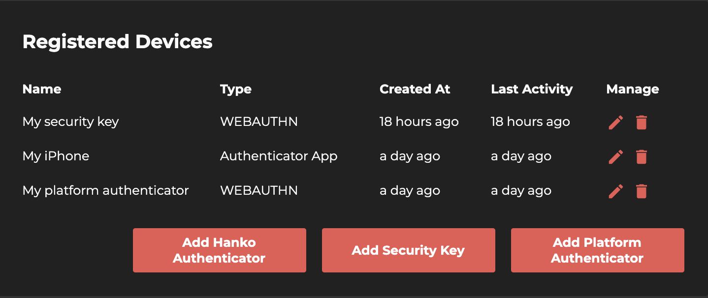

### Login using registered devices

The login experience differs depending on what type of authentication flow you configured 
(see [Configure Authentication Flows](#configure-authentication-flows)).

#### Login with passwordless flow

1. Access `/auth/realms/master/hanko/status` (replace **master** with your realm name if necessary). The browser will
display the configured username form:

    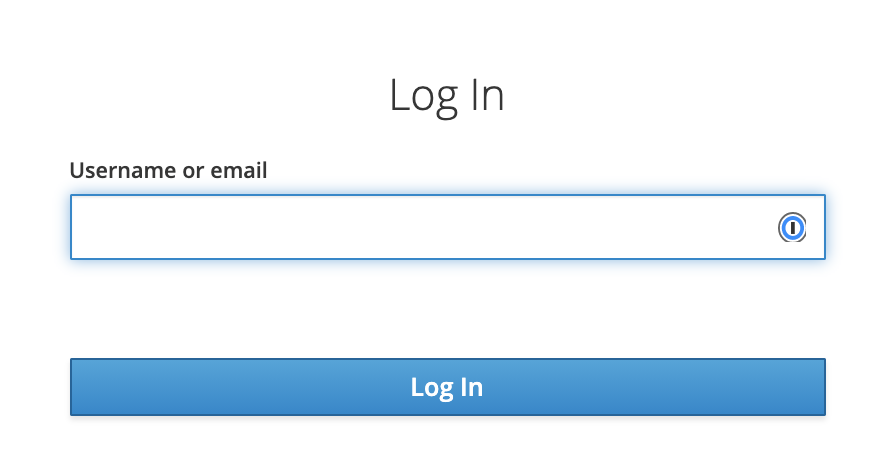
2. Enter a username or email and submit the form.
3. If
    - you last registered/logged in with an authenticator app this authentication type will be automatically 
    selected and the bound device will receive a notification. The 
    browser will display the following view:
        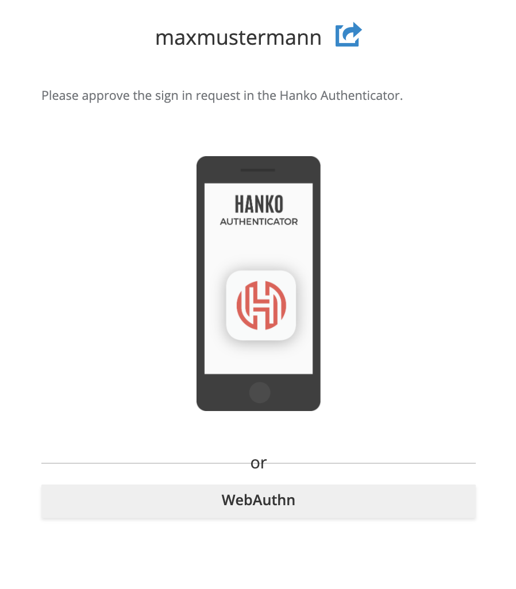
    - you last registered/logged in with a security key or platform authenticator this authentication type will be automatically 
    selected. The browser will display the following view and prompt for an authentication gesture:
        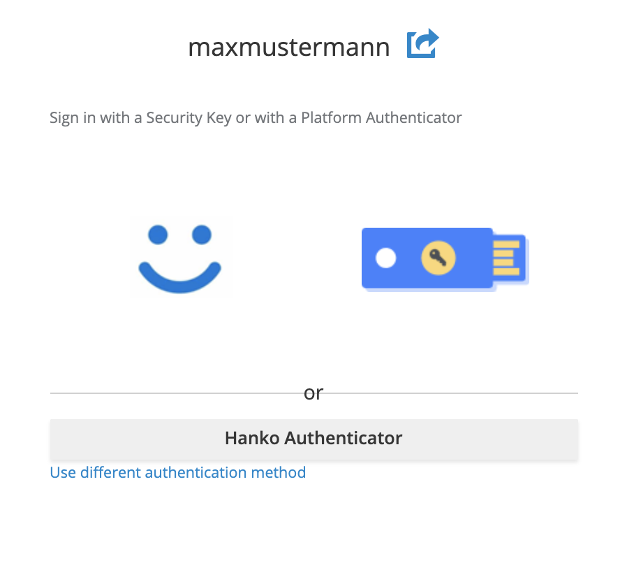

You can switch to a different authentication method by using the "Authenticator"/"Webauthn" button in the respective 
views.

#### Login with passwordless flow with password fallback

1. Access `/auth/realms/master/hanko/status` (replace **master** with your realm name if necessary). The browser will
display the configured username form:

    
2. Enter a username or email and submit the form.
3. Enter a password or select "Try another way" to choose a different authentication method:
    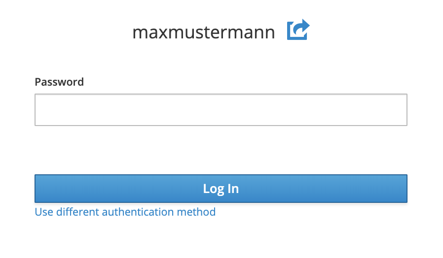
4. Select "Hanko Authenticator/WebAuthn" if you do not want to use a password:
    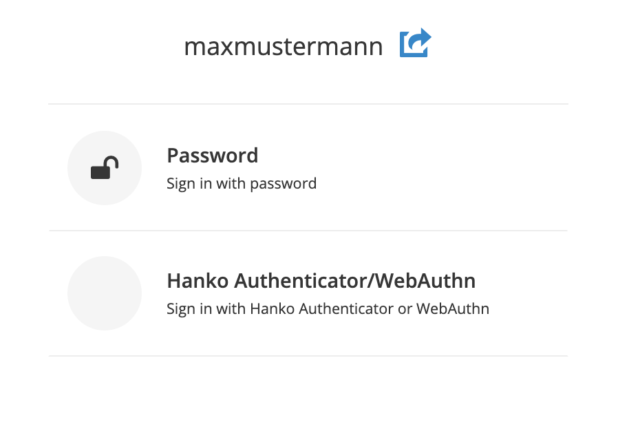
5. If
    - you last registered/logged in with an authenticator app this authentication type will be automatically 
    selected and the bound device will receive a notification. The 
    browser will display the following view:
        
    - you last registered/logged in with a security key or platform authenticator this authentication type will be automatically 
    selected. The browser will display the following view and prompt for an authentication gesture:
        
        

You can switch to a different authentication method by using the "Authenticator"/"Webauthn" button in the respective 
views.

## Using enrollment

As a (master) realm administrator you can:

- register security keys for other users.
- initiate device registration via Hanko Authenticator for other users. Once you have initiated registration you can use 
a generated QR code to deliver to your users for registration with a mobile device using an authenticator app.

### Who can enroll other users?

Only users with specific roles can enroll other users:

- As a master realm user with the role **admin** you can enroll users in other realms.
- As an admin of a realm other than **master** you can enroll only users of your own realm. To create an admin user for
your realm:
    1. Create a regular user in a realm:
        - Navigate to the administration console, log in, and select the realm of your choice (realms can be selected
        using a dropdown in the top left of the administration console sidebar).
        - In the administration console sidebar go to **Manage** -> **Users** -> **Add user** (button in the top right).
        - Fill in the required fields and press the **Save** button.
    2. Once redirected to the user details of the newly created user, open the **Credentials** tab and set a password 
    (set the slider **Temporary** to **off**).
    3. Open the **Role Mapping** tab:
        - Enter and select **realm-management** under **Client Roles**.
        - Select all available roles and press **Add selected**.
    4. Go to `/auth/admin/<REALM_NAME>/console` (replace <REALM_NAME> with the name of the realm in which you created 
    the user) and login.
    5. You should see administration console UI only for this realm.


> :warning: **WARNING**: In order to enroll a user from a specific realm the realm of this user  **must** have a 
> **Hanko Multi Authenticator** execution configured in the Authentication configuration of the bound browser flow 
> (see [Configure Authentication Flows](#configure-authentication-flows)).

### Enrolling users 

To add a new user and register a device/devices for this user leveraging the enrollment feature:

1. Select the realm in which you want to enroll a user (realms can be selected using a dropdown in the top left of the 
administration console sidebar).
2. Select **Users** in the **Manage** section of the sidebar. 
3. Select **Add User** in the top right of the displayed table.
4. Enter user data and save.
5. If you are not redirected to the user details of the newly created user, select **Users** in the **Manage** 
section of the sidebar and select "View All Users" in the upper left of the table. Select the previously created user.
6. Select the **Hanko Enrollment** Tab. The following screenshot shows the enrollment tab for a master realm admin user 
(**Hanko**) who wants to enroll a user **Maxmustermann** in the **Test** realm:
    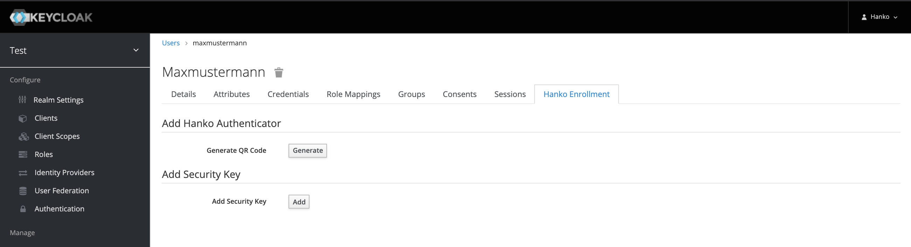
7. To add 
    - _a security key_: select **Add** under **Add a security key**. You will be prompted to attach the security to your
    device. You then need to perform an authentication gesture (biometric, PIN) to continue.
    - _a Hanko Authenticator_: select **Generate** under **Add Hanko Authenticator** to initialize registration and generate
    a QR code. The displayed QR code can be used by scanning via authenticator app in order to complete the registration. 
    
> :warning: **WARNING** Note that the registration process is subject to timeout constraints. The default value for an 
> initiated registration is 120 seconds. If you want to use registration initialization via QR code generation to - for 
> example - deliver generated QR codes to users via postal mail, then this timeout is unfeasible. You can increase 
> the timeout using the Hanko Developer Console (see [Prerequisites](#prerequisites)). 
>1. Go to `https://console.hanko.io`.
>2. Log in to your account.
>3. Once signed in, click your profile name/icon in the top right and in the dropdown select "Change organization".
>4. Select the appropriate organization (i.e. the one you created in [Prerequisites](#prerequisites)).
>5. Select the appropriate relying party (i.e. the one you created in [Prerequisites](#prerequisites)).
>6. Select "FIDO Settings" in the menu on the left.
>7. Provide the desired value in the "Registration" input.
>8. Click "Update Changes".

## Theming the account page

To modify the existing account page theme, you can change the `main.scss` file in the `hanko-account/src/styles` 
directory. Once modified, remember to run the build script `build.sh` as described in [Building](#building) to properly
pre-process the `.scss` file.

## License

This product is licensed under the [Apache License 2.0](http://www.apache.org/licenses/LICENSE-2.0).
